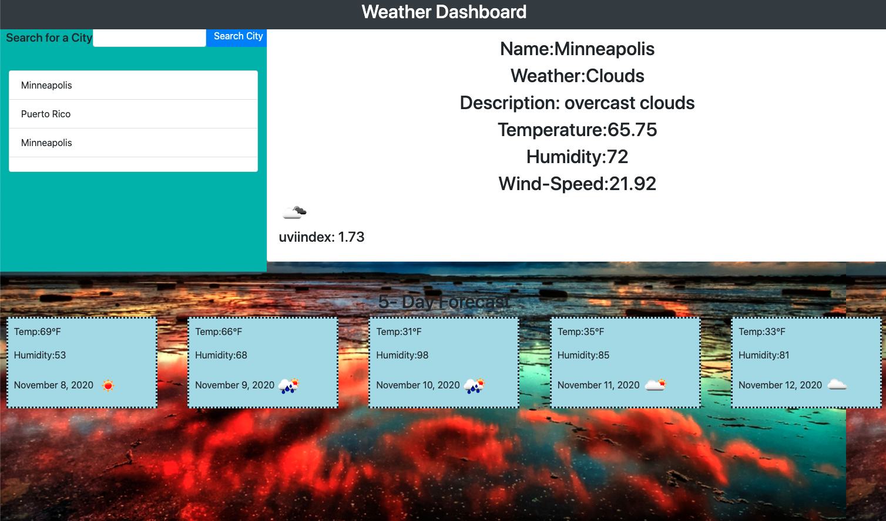

# Weather_Dashboard

# Description
This project's goal was to create a weather dashboard that allows a user to see the weather outlook for multiple cities and the 5 days forecast. 
This app will run in the browser and feature dynamically updated HTML and CSS powered by jQuery.

#  Weather_Dashboard

# Installation
The installation I used is:
* Terminal
* Visual Studio Code
* GitHub
* GitLab
* Moment - https://momentjs.com/
* Open Weather API -https://openweathermap.org/api
* Save to the Local Storage

# License

2020 Alice Piar All rights Reserved.

