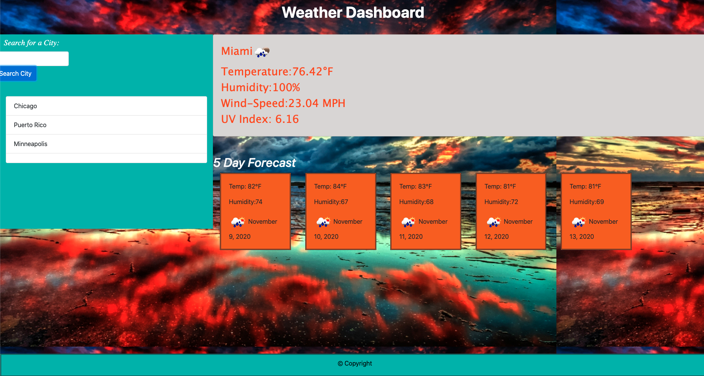

<h1 align="center"> Weather Dashboard</h1>
 

### Description
This project's goal was to create a weather dashboard that allows a user to see the weather outlook for multiple cities and the 5 days forecast. 
This app will run in the browser and feature dynamically updated HTML and CSS powered by jQuery.

## Visuals

### Badges:
 
 
 
 

# Installation
The installation I used is:
* Terminal
* Visual Studio Code
* GitHub
* GitLab
* Moment - https://momentjs.com/
* Open Weather API -https://openweathermap.org/api
* Save to the Local Storage

### Deploy Pages

https://adpir.github.io/Weather_Dashboard  
https://github.com/adpir/Weather_Dashboard

# License

Copyright  © 2020 Alice Piar University of Minnesota BootCamp All rights reserved.

